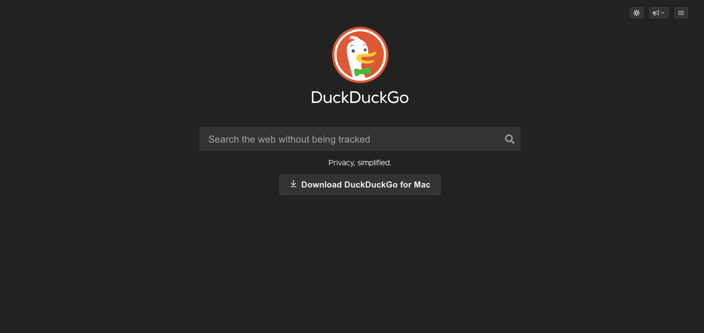
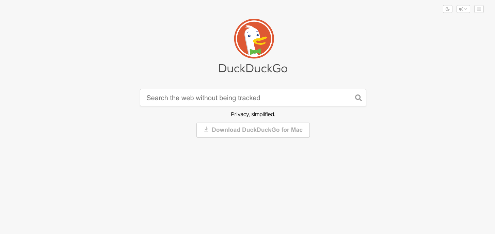

# DuckDuckGo-inspired Search Homepage

A small frontend project inspired by DuckDuckGo’s 2023 homepage design.

This app recreates the look and feel of the landing page with a minimal React + TypeScript implementation. Search queries are redirected to DuckDuckGo, so the project focuses on UI, layout, and interaction rather than building a custom search backend.

## Preview




## Live Demo

https://duck-duck-go-green.vercel.app/

## Features

- Homepage UI inspired by DuckDuckGo's 2023 design
- Search input that redirects queries to DuckDuckGo
- Responsive layout
- Component-based React structure
- Basic semantic HTML and accessibility considerations
- Built-in dark mode toggle (auto-detects system preference and allows manual switching)

## Tech Stack

- React
- TypeScript
- Vite
- CSS
- Vercel Analytics

## How It Works

The app renders a simplified DuckDuckGo-inspired homepage.
When a user submits a query, the search term is passed to DuckDuckGo and the user is redirected to the results page.

Example:

```
cats -> https://duckduckgo.com/?q=cats
```

## Motivation

I built this project as a frontend exercise to practice:

- recreating a recognizable real-world interface
- working with layout, spacing, and styling details
- structuring a small React application with reusable components

The goal was not to build a search engine, but to recreate the homepage experience as closely as possible based on DuckDuckGo’s 2023 design.

## Performance

Focus was placed on keeping the bundle lightweight and maintaining good accessibility and performance scores.

Lighthouse (deployed):

- Performance: 100
- Accessibility: 96
- Best Practices: 100
- SEO: 100

## Scope

This project focuses on the homepage UI only.

It does not include:

- a custom backend
- search indexing
- custom search results
- a pixel-perfect match to DuckDuckGo's current live site

## Running Locally

```bash
npm install
npm run dev
```

Then open the local Vite development URL in your browser.

## Build

```bash
npm run build
npm run preview
```

## Possible Improvements

- Add more robust accessibility testing
- Expand the recreated homepage sections
- Add visual regression screenshots for comparison
- Tests

## Dark Mode

The app supports dark mode out of the box. It automatically detects your system preference and applies the appropriate theme. You can also manually toggle between light and dark mode using the sun/moon button in the header. Theme preference is applied instantly and updates the UI colors accordingly.

## Disclaimer

This is an independent frontend practice project inspired by DuckDuckGo's 2023 homepage design. It is not affiliated with or endorsed by DuckDuckGo.
